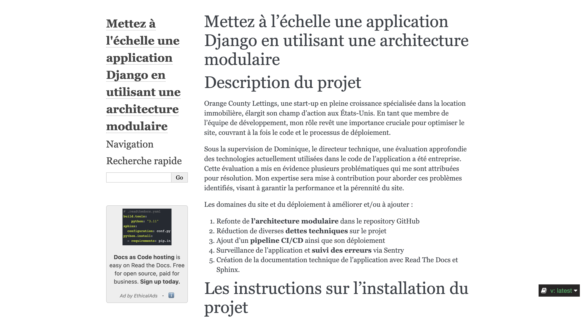
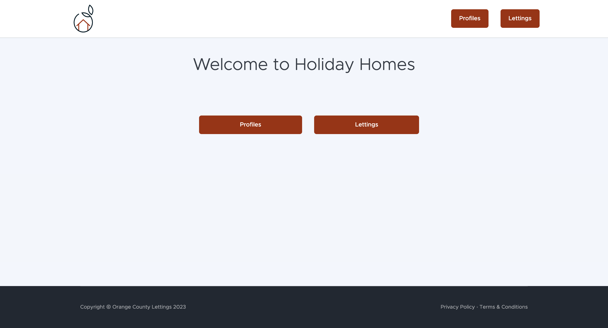
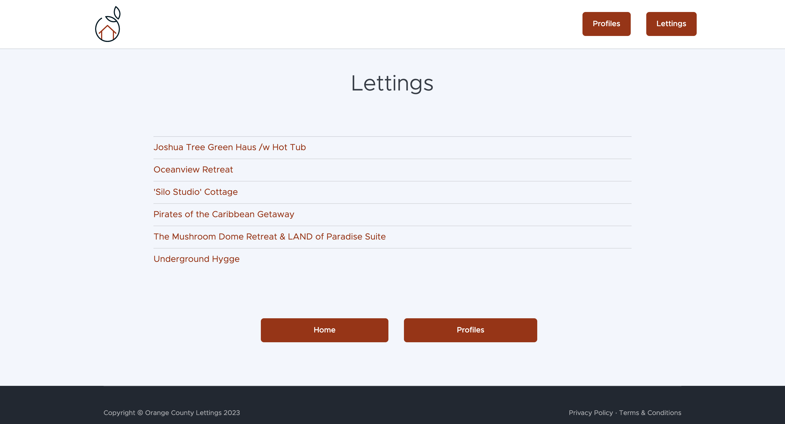
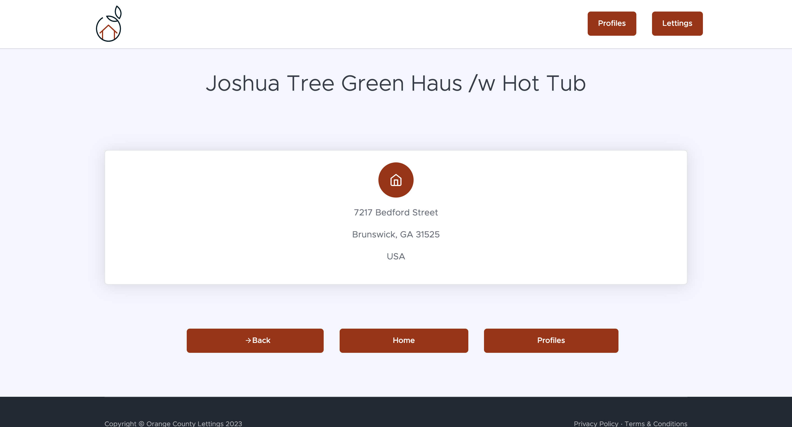
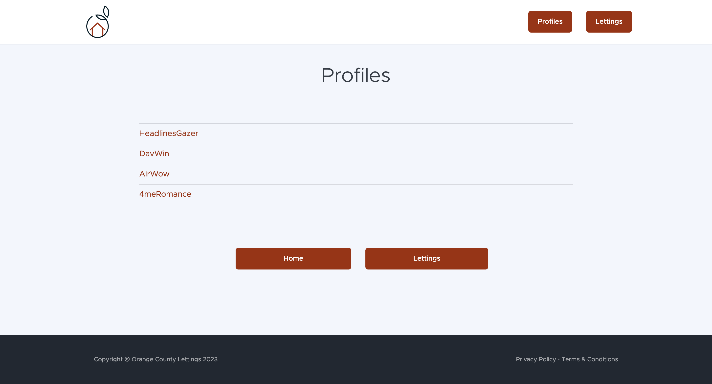
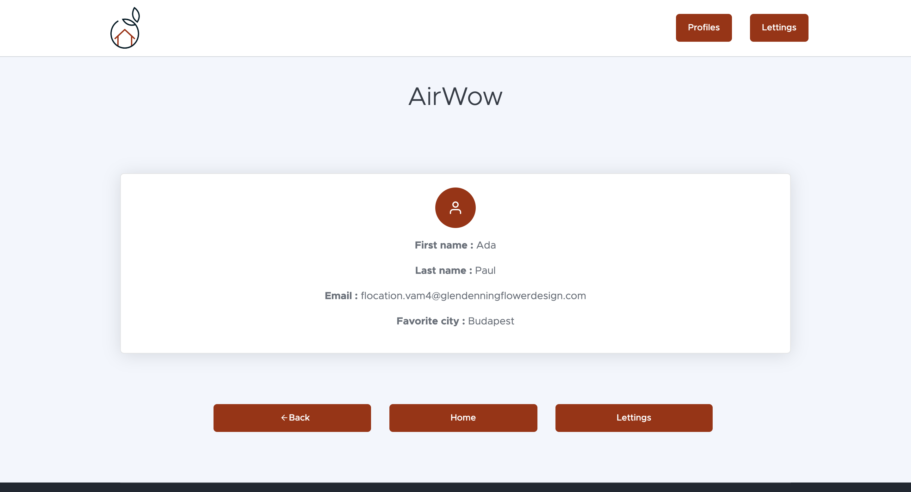
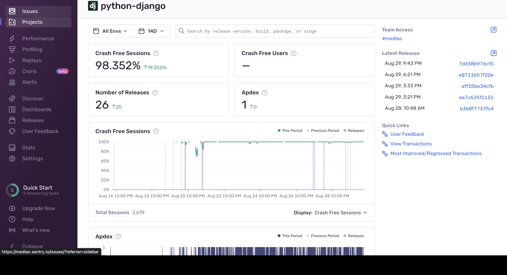
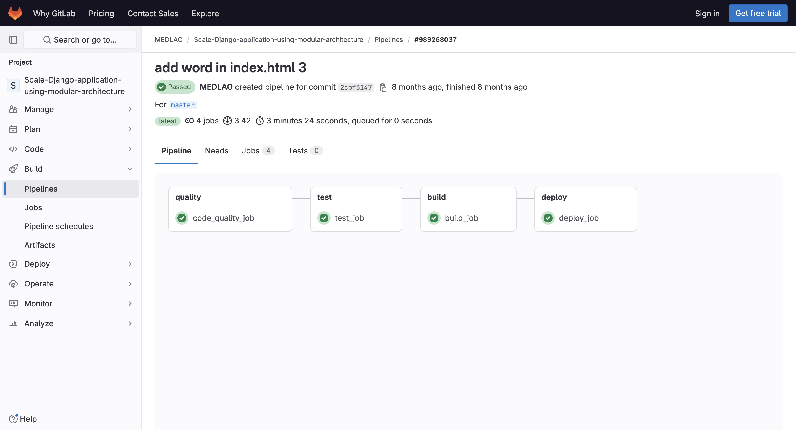
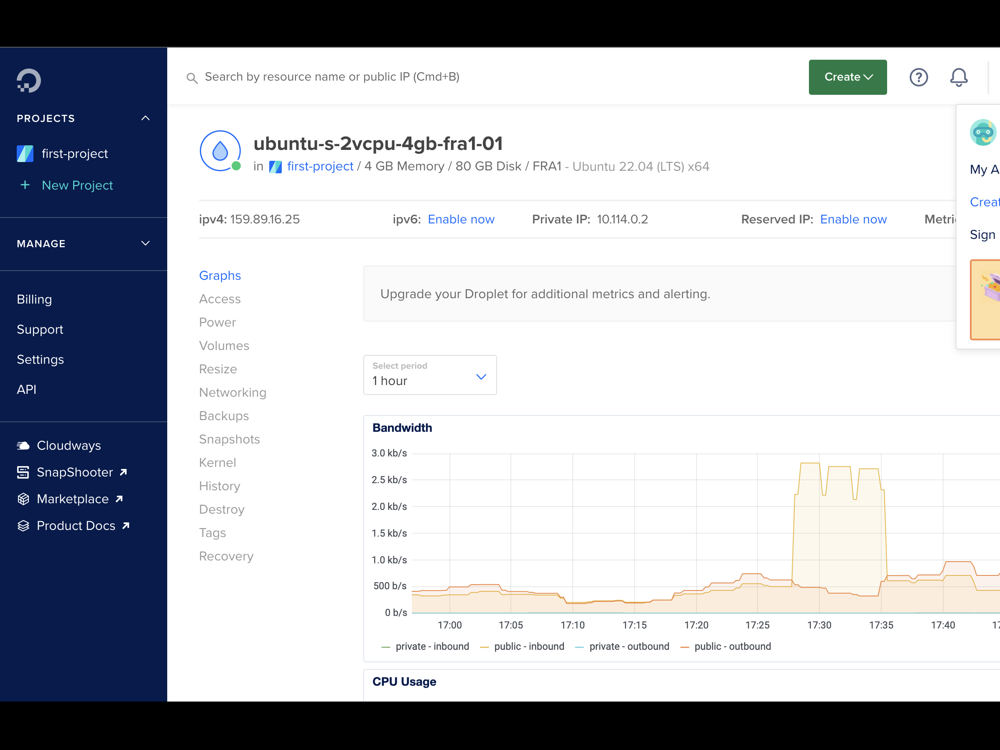

## Summary

Orange County Lettings Website

[**Français**](README-fr.md)

  
  
  
  
  
  
  
  
  

## Local development

### Prerequisites

- GitHub account with read access to this repository
- Git CLI
- SQLite3 CLI
- Python interpreter, version 3.6 or higher

In the rest of the documentation on local development, it is assumed that the `python` command
in your OS shell runs the above Python interpreter (unless a virtual environment is activated).

### macOS / Linux

#### Clone the repository

- `cd /path/to/put/project/in`
- `git clone https://github.com/OpenClassrooms-Student-Center/Python-OC-Lettings-FR.git`

#### Create the virtual environment

- `cd /path/to/Python-OC-Lettings-FR`
- `python -m venv venv`
- `apt-get install python3-venv` If the previous step encounters errors with a package not found
  on Ubuntu
- Activate the environment `source venv/bin/activate`
- Confirm that the `python` command runs the Python interpreter in the virtual environment
  `which python`
- Confirm that the Python interpreter version is 3.6 or higher `python --version`
- Confirm that the `pip` command runs the pip executable in the virtual environment, `which pip`
- To deactivate the environment, `deactivate`

#### Run the site

- `cd /path/to/Python-OC-Lettings-FR`
- `source venv/bin/activate`
- `pip install --requirement requirements.txt`
- `python manage.py runserver`
- Go to `http://localhost:8000` in a browser.
- Confirm that the site is functioning and navigable (you should see multiple profiles and
  listings).

#### Linting

- `cd /path/to/Python-OC-Lettings-FR`
- `source venv/bin/activate`
- `flake8`

#### Unit tests

- `cd /path/to/Python-OC-Lettings-FR`
- `source venv/bin/activate`
- `pytest`

#### Database

- `cd /path/to/Python-OC-Lettings-FR`
- Open a shell session `sqlite3`
- Connect to the database `.open oc-lettings-site.sqlite3`
- Display the tables in the database `.tables`
- Display the columns in the profiles table, `pragma table_info(profiles_profile);`
- Run a query on the profiles table, `select user_id, favorite_city from
  profiles_profile where favorite_city like 'B%';`
- `.quit` to exit

#### Admin panel

- Go to `http://localhost:8000/admin`
- Log in with the user `admin`, password `Abc1234!`

### Windows

Using PowerShell, as above except :

- To activate the virtual environment, `.\venv\Scripts\Activate.ps1` 
- Replace `which <my-command>` with `(Get-Command <my-command>).Path`
